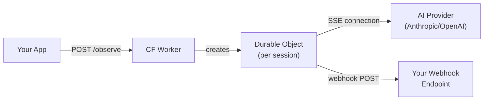
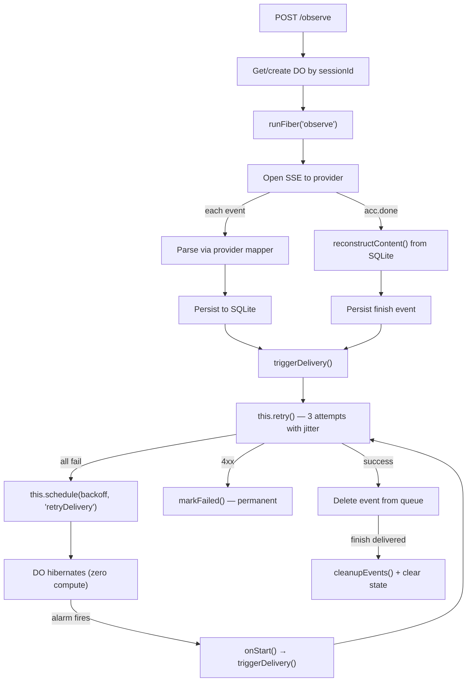

# Thalamus Session Observer — Cloudflare Worker

A Cloudflare Worker using the [Agents SDK](https://developers.cloudflare.com/agents/) that observes AI provider SSE streams on behalf of your application and delivers events via webhook. Each session runs in its own Durable Object with SQLite-backed persistence, surviving process crashes, network interruptions, and DO evictions.

## Architecture



## Lifecycle



## How It Works

### 1. Observation

When your app calls `provider.send()` with a `durable: cloudflare(...)` config, the SDK sends a `POST /observe` request to this worker with:

- `sessionId` — the AI provider's session identifier
- `streamUrl` — the SSE endpoint to observe (e.g., Anthropic's managed agents SSE URL)
- `headers` — auth headers for the SSE connection
- `provider` — which parser to use (`anthropic` or `openai`)
- `webhook` — `{ url, secret, metadata? }` for delivery

The worker creates a Durable Object keyed by `sessionId` and starts observing.

### 2. SSE Parsing & Persistence

The DO opens a long-lived SSE connection to the AI provider. Each SSE event is:

1. Parsed through the provider-specific mapper (`mapAnthropicEvent` / `mapOpenAIEvent`) into normalized `StreamPart` events
2. Persisted to SQLite with a sequence number and `pending` status
3. Immediately queued for webhook delivery

An `EdgeAccumulator` tracks `done`, `finishReason`, `usage`, and `sessionId` without buffering content (O(1) memory regardless of response length).

### 3. Webhook Delivery

Events are delivered one-at-a-time in order via `POST` to your webhook URL:

```json
{
  "sessionId": "sesn_01...",
  "sequence": 5,
  "timestamp": 1779188497225,
  "provider": "anthropic",
  "metadata": { "userId": "u_123" },
  "event": { "type": "text-delta", "text": "Hello" }
}
```

Each request includes:
- `X-Thalamus-Signature` — HMAC-SHA256 for verification
- `X-Thalamus-Event-Type` — the event type
- `X-Thalamus-Session-Id` — session identifier
- `X-Thalamus-Sequence` — ordering guarantee

### 4. Retry & Recovery

Delivery uses Cloudflare's recommended patterns:

| Layer | Mechanism | Purpose |
|-------|-----------|---------|
| Immediate | `this.retry()` (3 attempts, jittered backoff) | Handle momentary failures |
| Deferred | `this.schedule(backoffSec, 'retryDelivery')` | Consumer is down — hibernate and retry later |
| Safety net | `onStart()` hook | On any DO wake, check for stuck pending events |
| Durable execution | `runFiber()` + `ctx.stash()` | SSE observation survives DO eviction |

Backoff schedule per cycle: 2s → 4s → 8s → 16s → 32s → 60s (capped). After `MAX_ATTEMPTS` (10) cycles, events are marked dead.

### 5. Finish Event

When the provider signals completion (`session.status_idle` for Anthropic, `response.completed` for OpenAI):

1. The SSE loop breaks
2. Full response content is reconstructed from persisted `text-delta` events using SQLite's `json_extract` (no in-memory buffering)
3. A `finish` event with complete `response.content`, `finishReason`, and `usage` is persisted and delivered

## API Endpoints

| Method | Path | Description |
|--------|------|-------------|
| `POST` | `/observe` | Start observing a session |
| `DELETE` | `/observe/:sessionId` | Stop observation (pending events still deliver) |
| `GET` | `/health` | Health check |

## Configuration

`wrangler.toml`:

```toml
name = "thalamus-session-observer"
main = "src/index.ts"
compatibility_date = "2025-04-01"
compatibility_flags = ["nodejs_compat"]

[durable_objects]
bindings = [
  { name = "SESSION_OBSERVER", class_name = "SessionObserver" }
]

[[migrations]]
tag = "v1"
new_sqlite_classes = ["SessionObserver"]

[vars]
# Optional: set API_KEY to require Bearer auth on all endpoints
# API_KEY = "your-secret"
```

## Deployment

```bash
cd cloudflare-worker
pnpm install
npx wrangler deploy
```

Set `API_KEY` via Wrangler secrets for production:

```bash
npx wrangler secret put API_KEY
```

## Observability

The worker logs structured warnings and errors queryable via [Workers Observability](https://developers.cloudflare.com/workers/observability/):

| Level | Message pattern | Meaning |
|-------|----------------|---------|
| `warn` | `Webhook delivery failed: session=X seq=Y attempts=Z` | Transient failure, will retry |
| `warn` | `Webhook 4xx (permanent failure): session=X seq=Y` | Consumer rejected event |
| `error` | `Event delivery exhausted: session=X seq=Y type=Z` | Max retries reached |

Query active retries:
```
filter: $metadata.service = "thalamus-session-observer" AND $metadata.level = "warn"
```

Query dead events:
```
filter: $metadata.service = "thalamus-session-observer" AND $metadata.level = "error"
```

## Development

```bash
cd cloudflare-worker
pnpm install
npx wrangler dev          # local dev server
npx tsc --noEmit          # typecheck
```

The worker depends on `@novu/thalamus` as a workspace package (linked via `pnpm-workspace.yaml`). Changes to the main package are immediately reflected without publishing.
