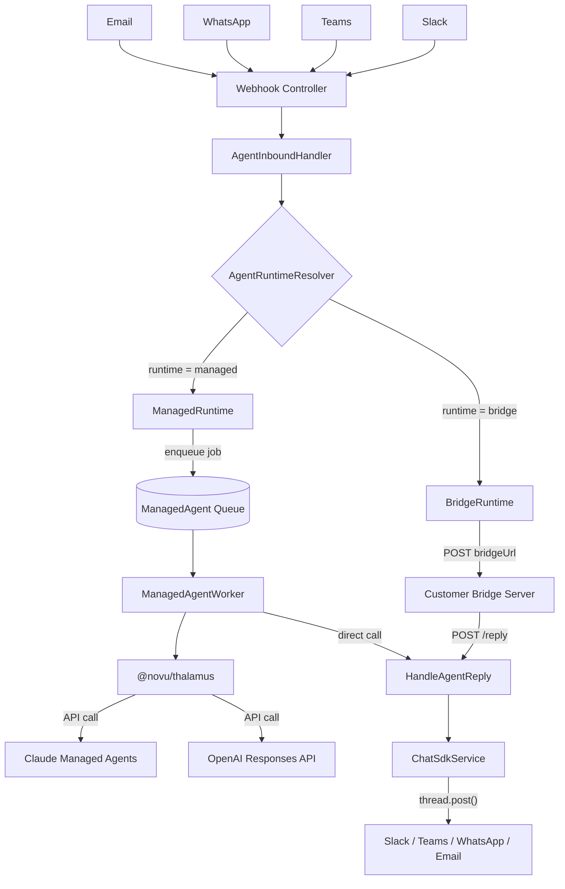
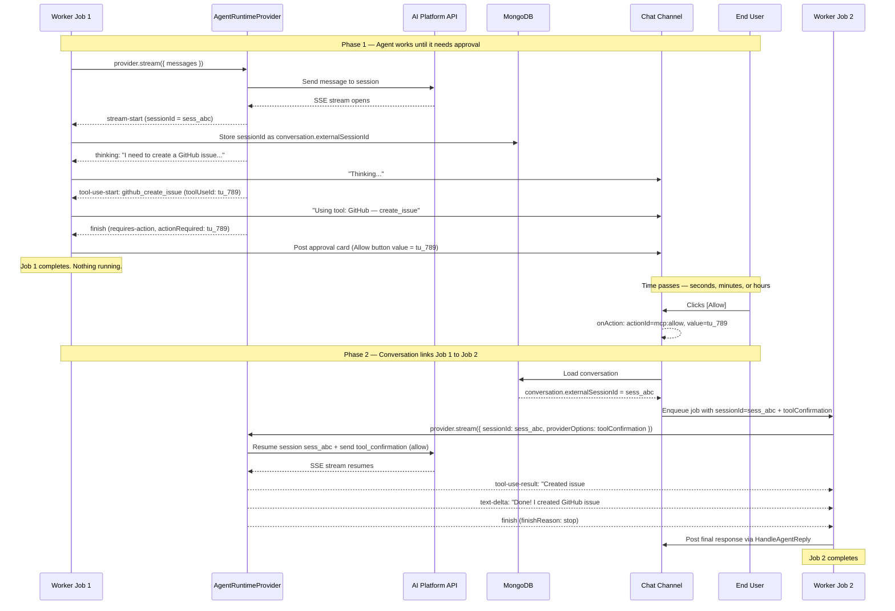

# Agent Runtimes — Design Spec

> Unified TypeScript package for sending conversation turns to managed AI agent platforms.
> Extends the existing Agent Conversations feature with managed provider support.

---

## 1. Context & Motivation

### Current State

Novu's Agent Conversations feature provides a distribution and orchestration layer for conversational AI. Today, the user hosts their own AI agent "brain" and exposes it via a bridge URL. Novu handles:

- Inbound webhooks from chat platforms (Slack, Teams, WhatsApp, Email)
- Subscriber identity and conversation persistence
- Delivery via Chat SDK `thread.post()`
- Signal execution (metadata, trigger, resolve)

The bridge protocol is a signed HTTP POST from Novu to the customer's URL. The customer's `@novu/framework` handler processes the message asynchronously and calls back via `/v1/agents/:id/reply`.

### Problem

Users increasingly build agents on managed platforms — Claude Managed Agents, OpenAI Responses API, LangGraph Cloud, VertexAI Agent Builder. These users don't want to host a bridge server. They want to point Novu at their managed agent and have it work.

### Goal

Build `@novu/thalamus` — a standalone open-source package (separate repository: `novuhq/thalamus`) that:

1. Provides a provider-agnostic interface for "message in → streamed response out"
2. Ships with Claude Managed Agents and OpenAI (Responses API) as initial providers, each with optional AWS authentication
3. Plugs into the existing Agent Conversations architecture as an alternative to the bridge runtime
4. Published on npm as `@novu/thalamus`

### Reference Material

- [Agent Conversations Architecture (Notion)](https://www.notion.so/novuhq/Agent-Conversations-Architecture-343d03ad838f80a6b9feef4ad6a3fdc7)
- [POC PR #10990](https://github.com/novuhq/novu/pull/10990) — vibecoded demo, inspiration for runtime factory pattern
- [Vercel AI SDK](https://github.com/vercel/ai) — provider interface pattern inspiration
- [@codewithdan/agent-sdk-core](https://www.npmjs.com/package/@codewithdan/agent-sdk-core) — event normalization pattern inspiration
- [OpenAI Responses API](https://developers.openai.com/api/docs/guides/migrate-to-responses) — agentic loop with built-in tools, remote MCP, and server-managed conversations
- [OpenAI Conversations API](https://developers.openai.com/api/docs/guides/conversation-state) — server-managed multi-turn state (replaces Threads)
- [Claude Platform on AWS](https://platform.claude.com/docs/en/build-with-claude/claude-platform-on-aws) — full native Anthropic API via AWS auth (SigV4), same API surface as direct Anthropic API
- [Amazon Bedrock OpenAI-compatible API](https://docs.aws.amazon.com/bedrock/latest/userguide/inference-openai.html) — OpenAI Responses API via Bedrock endpoint with AWS auth

---

## 2. Design Decisions


| Decision           | Choice                                                                          | Rationale                                                                                                                                                                                                                                                                                                                                                       |
| ------------------ | ------------------------------------------------------------------------------- | --------------------------------------------------------------------------------------------------------------------------------------------------------------------------------------------------------------------------------------------------------------------------------------------------------------------------------------------------------------- |
| Package location   | Standalone repo `novuhq/thalamus`, published as `@novu/thalamus`                | Clean public API, zero Novu internal leakage. Own release cadence, CI, and issue tracking. Novu monorepo consumes it as an npm dependency.                                                                                                                                                                                                                      |
| Core scope         | Conversation turn only                                                          | Lifecycle management (create/configure/delete agents on provider platforms) varies wildly across providers. Belongs in Novu API layer.                                                                                                                                                                                                                          |
| Streaming          | Streaming-first, consumable as request/response                                 | Most providers support streaming. Interface always returns a stream + a `response` promise for simple consumption.                                                                                                                                                                                                                                              |
| Tool use           | Opaque — managed platforms own their tools                                      | Managed agent platforms configure tools at agent creation time or via stored config, not per-request. Unlike raw LLM SDKs, this package doesn't need tool definitions. Stream events report what tools the agent used.                                                                                                                                          |
| Multimodal         | `content` supports text or content parts array                                  | Subscribers send images, screenshots, files via chat channels. Both Claude sessions and OpenAI conversations accept multimodal content natively.                                                                                                                                                                                                                |
| Session ID         | First-class field on params and response                                        | Most important state for multi-turn managed agents. Explicit rather than buried in `providerOptions`. Inspired by agent-sdk-core's `resumeSessionId`.                                                                                                                                                                                                          |
| History management | Caller passes current turn + optional history; package is stateless             | Novu already owns conversation history via ConversationActivity. Separating `messages` (current turn) from `history` (prior context) mirrors the internal data flow and matches managed agent APIs that only expect the new message per turn.                                                                                                                   |
| Initial providers  | Anthropic (Claude Managed Agents) + OpenAI (Responses API), each with optional AWS auth | Two managed agent platforms with distinct session models. Claude: session-based SSE. OpenAI: conversations+responses. Each supports direct API-key auth and AWS auth (Claude Platform on AWS via `@anthropic-ai/aws-sdk`, OpenAI via Bedrock's OpenAI-compatible endpoint). AWS auth is a constructor-level config, not a separate provider.                    |
| Integration point  | Managed runtime calls `HandleAgentReply` use case directly                      | No unnecessary HTTP round-trip. Reply use case already handles persistence, delivery, signals.                                                                                                                                                                                                                                                                  |
| Naming             | `thalamus` (package) / `AgentRuntime*` (internal types)                         | Named after the brain's relay center — routes inputs to the right processing region. Internal types keep descriptive `AgentRuntime*` prefix for code clarity.                                                                                                                                                                                                   |


---

## 3. Core Interfaces

### Provider Interface

```typescript
interface AgentRuntimeProvider {
  readonly provider: string;    // use exported constants: ANTHROPIC, OPENAI, etc.
  readonly runtimeId: string;   // instance identifier (agent_id, prompt_id, etc.)

  send(params: AgentRuntimeParams): Promise<AgentRuntimeResponse>;
  stream(params: AgentRuntimeParams): Promise<AgentRuntimeStreamResult>;
  endSession?(sessionId: string): Promise<void>;
  validate?(): Promise<boolean>;
}

// String constants for built-in providers (extensible — community providers use any string)
const ANTHROPIC = 'anthropic' as const;
const OPENAI = 'openai' as const;
```

`provider` is a `string` rather than an enum so that community providers can set any value without modifying the package source. Built-in providers export string constants for type safety.

`send` returns the full response. `stream` returns an async iterable for progressive consumption. Both accept the same input. Providers that only support streaming can implement `send` by collecting the stream internally — `stream-utils.ts` provides a `collectStream()` helper for this.

`endSession` is optional — providers with server-side sessions (Claude archives sessions, OpenAI deletes conversations) implement it to clean up when a conversation is resolved. Called by the worker on conversation resolve.

`validate` is optional — a lightweight health check that verifies the provider's credentials and agent/prompt still exist. Used by the dashboard "test connection" step (Phase 4). Providers that support it return `true`/`false` rather than throwing.

### Input

```typescript
interface RequestParams {
  message: Message;                          // the user's message for this turn
  sessionId?: string;                        // resume existing session
  history?: Message[];                       // prior conversation for session recovery
  providerOptions?: Record<string, unknown>; // provider-specific pass-through
}

enum MessageRole {
  USER = 'user',
  ASSISTANT = 'assistant',
  SYSTEM = 'system',
}

interface Message {
  role: MessageRole;
  content: string | ContentPart[];
}

type ContentPart =
  | { type: 'text'; text: string }
  | { type: 'image'; data: string; mediaType: string }   // base64 inline
  | { type: 'image-url'; url: string }                    // URL reference
  | { type: 'file'; data: string; mediaType: string; name?: string };
```

> **Design change (decided during implementation):** `message` is singular, not `messages[]`. Every managed agent turn is exactly one user message — the subscriber typed one thing. The original spec had `messages[]` to allow smuggling per-turn system context alongside the user message, but implementation revealed this creates ambiguity: Anthropic managed agents have no per-turn system message mechanism (system prompt is on the agent config), and the `[System]:` prefix hack is unreliable. Per-turn context belongs in `providerOptions` (e.g. OpenAI `instructions`) or platform-level config (agent system prompt, session resources), not in the message array. Singular `message` makes the DX impossible to misuse.

`message` is the user's message for this turn. Always `role: user`. The provider converts it to the platform's native format (Anthropic content blocks, OpenAI input messages).

`sessionId` is a first-class field for resuming provider sessions. On the first turn it's omitted — the provider creates a new session. On subsequent turns, the caller passes the session ID returned from the previous turn. This is the primary mechanism for multi-turn continuity.

`history` is only needed when `sessionId` is absent and there is prior conversation context to recover. This is a **session recovery mechanism**, not the normal path.

**When is `history` populated?** Under normal operation, the first turn of a conversation has no history — the user just said "Hello" and there's nothing prior. On all subsequent turns, `sessionId` is present and the provider's server-side session already has full context, so `history` is not needed. `history` exists for edge cases:

- **Session expiry.** Provider session timed out (e.g. Claude session expired after inactivity). The worker detects a 404/410 on resume, clears `externalSessionId`, and re-invokes with `sessionId` absent and `history` populated from ConversationActivity — so the agent doesn't lose memory mid-conversation.
- **Provider migration.** User switches an agent from one provider to another mid-conversation. The old session ID is meaningless for the new provider. `history` carries the conversation context forward.
- **Replay after provider-side data loss.** Novu is the source of truth for conversation history, not the provider. `history` enables reconstruction.

**Provider contract for `message` and `history`:**

- Always process `message` — this is the input for this turn.
- When creating a new session (no `sessionId`): use `history` to seed the provider session if present and the provider supports it. On a brand-new conversation, `history` will be absent — this is the normal case.
- When resuming a session (with `sessionId`): ignore `history` — the provider's session already has full context.

`content` can be a plain string for text-only messages, or an array of `ContentPart` for multimodal messages (e.g. a subscriber sends a screenshot with a question). Each provider's transformer converts content parts to the provider's native format — Claude uses `{ type: 'image', source: { type: 'base64', ... } }`, OpenAI uses `{ type: 'image_url', image_url: { url } }`.

`providerOptions` is the escape hatch for provider-specific configuration (Claude session settings, OpenAI `instructions`, model overrides, etc.) that doesn't map to the generic interface.

### Output

```typescript
interface AgentRuntimeResponse {
  content: string;
  sessionId?: string;
  finishReason: 'stop' | 'length' | 'error' | 'tool-calls' | 'requires-action' | 'other';
  usage?: AgentRuntimeUsage;
  actionsRequired?: AgentRuntimeActionRequired[];
  providerMetadata?: Record<string, unknown>;
}

interface AgentRuntimeActionRequired {
  type: 'tool-confirmation';
  toolUseId: string;
  toolName: string;
  input?: Record<string, unknown>;
}

interface AgentRuntimeUsage {
  inputTokens?: number;
  outputTokens?: number;
  totalTokens?: number;
}
```

### Streaming

```typescript
interface AgentRuntimeStreamResult {
  stream: AsyncIterable<AgentRuntimeStreamPart>;
  response: Promise<AgentRuntimeResponse>;  // resolves when stream completes
}

type AgentRuntimeStreamPart =
  // Content
  | { type: 'text-delta'; text: string }
  | { type: 'thinking'; text: string }

  // Tool lifecycle
  | { type: 'tool-use-start'; toolName: string; toolUseId: string; input?: Record<string, unknown> }
  | { type: 'tool-use-result'; toolUseId: string; output?: string }

  // Session lifecycle
  | { type: 'stream-start'; sessionId?: string; metadata?: Record<string, unknown> }
  | { type: 'finish'; response: AgentRuntimeResponse }
  | { type: 'error'; error: Error }

  // Escape hatch for provider-specific events
  | { type: 'provider-event'; provider: string; event: string; data: Record<string, unknown> };
```

`AgentRuntimeStreamResult` provides both `stream` (for progressive edits on Slack/Teams) and `response` (a promise that resolves to the full response when done).

Stream part types are a discriminated union on the `type` field — extensible by adding new branches without breaking existing consumers. The `provider-event` escape hatch forwards provider-specific events that don't map to normalized types.

When `finishReason` is `'requires-action'`, the stream completes and the consumer should inspect `response.actionsRequired` to determine what's needed (e.g. tool confirmations — Claude Managed Agents can request human approval for MCP tool use). Then re-invoke `stream()` with `response.sessionId` and the action results in `providerOptions`.

### Content Transformer

Each provider has an internal content transformer that converts `ContentPart[]` to the provider's native content block format. The transformer is a pure format converter — no role-based logic, no message filtering.

```typescript
// Example: Anthropic transformer (internal to the provider)
function toContentBlocks(content: Message['content']): AnthropicContentBlock[];
```

Transformers are internal implementation details of each provider. The provider calls the transformer inside `stream()`/`send()` — consumers never interact with it directly.

---

## 4. Factory Functions & Provider Configuration

Each provider has a factory function. Config is provider-specific — no generic "create runtime" that tries to normalize.

The package exports a `thalamus` namespace object that groups all factory functions for discoverability, plus individual named exports for tree-shaking:

```typescript
// Namespace export — the primary entry point
export const thalamus = {
  anthropic: createAnthropicAgentRuntime,
  openai: createOpenAIAgentRuntime,
} as const;

// Individual factory functions also exported for direct import
```

```typescript
// Anthropic (Claude Managed Agents — direct API or Claude Platform on AWS)
function createAnthropicAgentRuntime(config: {
  agentId: string;
  environmentId: string;
  model?: string;
  // Direct Anthropic API auth
  apiKey?: string;
  // Claude Platform on AWS auth — uses @anthropic-ai/aws-sdk (AnthropicAws extends Anthropic)
  awsRegion?: string;
  awsWorkspaceId?: string;
}): AgentRuntimeProvider;

// OpenAI (Responses API — direct API or AWS Bedrock OpenAI-compatible endpoint)
function createOpenAIAgentRuntime(config: {
  promptId?: string;           // stored prompt config (created in OpenAI dashboard)
  instructions?: string;       // alternative: inline instructions (used when no promptId)
  tools?: OpenAIToolConfig[];  // built-in tools (web_search, file_search, code_interpreter) + remote MCP servers
  model?: string;
  // Direct OpenAI API auth
  apiKey?: string;
  // OpenAI on AWS Bedrock auth — same OpenAI SDK with Bedrock endpoint + SigV4
  awsRegion?: string;
  awsBedrockModelId?: string;  // e.g. 'us.openai.gpt-4o-2024-11-20'
}): AgentRuntimeProvider;
```

### Usage Example

```typescript
import { thalamus } from '@novu/thalamus';

const runtime = thalamus.anthropic({
  apiKey: process.env.ANTHROPIC_API_KEY,
  agentId: 'agent_abc123',
  environmentId: 'env_xyz789',
});

const result = await runtime.stream({
  message: { role: MessageRole.USER, content: 'Help me with billing' },
  // first turn: no sessionId, no history — provider creates a new session
  // subsequent turns: sessionId: 'session_abc' (history not needed, server has context)
});

for await (const part of result.stream) {
  if (part.type === 'text-delta') {
    process.stdout.write(part.text);
  }
}

const response = await result.response;
console.log('Done:', response.content);
```

---

## 5. Repository & Package Structure

`@novu/thalamus` lives in its own repository (`novuhq/thalamus`), published as a single npm package with **subpath exports** for tree-shaking — consumers only bundle the providers they use.

### Repository Layout

```
thalamus/
├── package.json
├── tsconfig.json
├── tsup.config.ts
├── biome.json
├── vitest.config.ts
├── .changeset/
│   └── config.json
├── .github/
│   └── workflows/
│       ├── ci.yml                              # lint + typecheck + test on PR
│       └── release.yml                         # changesets → npm publish
├── src/
│   ├── index.ts                                # root entry: thalamus namespace, shared types, errors, stream-utils
│   ├── types.ts                                # AgentRuntimeProvider, AgentRuntimeParams, etc.
│   ├── errors.ts                               # error hierarchy
│   ├── stream-utils.ts                         # collectStream(), mapStream()
│   ├── anthropic/
│   │   ├── index.ts                            # subpath entry: factory + transformer
│   │   ├── anthropic.provider.ts
│   │   └── anthropic.transformer.ts
│   └── openai/
│       ├── index.ts
│       ├── openai.provider.ts
│       └── openai.transformer.ts
└── __tests__/
    ├── anthropic/
    ├── openai/
    └── stream-utils.test.ts
```

### `package.json` exports map

```jsonc
{
  "name": "@novu/thalamus",
  "type": "module",
  "exports": {
    ".": {
      "import": "./dist/index.mjs",
      "require": "./dist/index.cjs",
      "types": "./dist/index.d.ts"
    },
    "./anthropic": {
      "import": "./dist/anthropic/index.mjs",
      "require": "./dist/anthropic/index.cjs",
      "types": "./dist/anthropic/index.d.ts"
    },
    "./openai": {
      "import": "./dist/openai/index.mjs",
      "require": "./dist/openai/index.cjs",
      "types": "./dist/openai/index.d.ts"
    }
  },
  "peerDependencies": {
    "@anthropic-ai/sdk": ">=0.86",
    "@anthropic-ai/aws-sdk": ">=0.86",
    "openai": ">=4.87"
  },
  "peerDependenciesMeta": {
    "@anthropic-ai/sdk": { "optional": true },
    "@anthropic-ai/aws-sdk": { "optional": true },
    "openai": { "optional": true }
  }
}
```

Consumers install only what they need:

```bash
# Direct Anthropic API
pnpm add @novu/thalamus @anthropic-ai/sdk

# Claude Platform on AWS
pnpm add @novu/thalamus @anthropic-ai/sdk @anthropic-ai/aws-sdk

# Direct OpenAI API
pnpm add @novu/thalamus openai
```

```typescript
import { thalamus } from '@novu/thalamus';
import { createAnthropicAgentRuntime } from '@novu/thalamus/anthropic';
```

Unused providers are never bundled.

### Tech Stack


| Concern         | Tool                     | Rationale                                                                                                 |
| --------------- | ------------------------ | --------------------------------------------------------------------------------------------------------- |
| Build           | **tsup** (esbuild-based) | Dual CJS + ESM output, `.d.ts` generation, multiple entry points via `entry` array. Fast, minimal config. |
| Test            | **vitest**               | Native ESM, Jest-compatible API, fast watch mode.                                                         |
| Lint + Format   | **Biome**                | Single tool for lint and format. Fast, good defaults, no ESLint plugin sprawl.                            |
| Package manager | **pnpm**                 | Strict, fast, consistent with Novu monorepo.                                                              |
| Versioning      | **Changesets**           | Changelog generation, npm publish automation, GitHub release creation.                                    |
| Module format   | **Dual CJS + ESM**       | Consumers may be CJS (Novu worker) or ESM (modern bundlers).                                              |
| TS target       | **ES2022**               | Native `AsyncIterable`, top-level `await`, `Error.cause`. Matches Node 18+ LTS.                           |
| CI              | **GitHub Actions**       | Standard for public repos. Runs lint, typecheck, test on PR; changesets release on merge to main.         |


### Design Choices

- **Single package, subpath exports.** One repo, one `package.json`, but consumers tree-shake by importing only `@novu/thalamus/anthropic`. Avoids monorepo overhead for what is conceptually one library.
- **Self-contained provider folders.** Adding a new provider = add a folder, implement the interface, add a subpath export entry, export from root index.
- **No local type redefinitions.** Provider-specific types (event shapes, content blocks) are imported directly from vendor SDKs rather than redefined in `<provider>.types.ts` files. Since SDKs are peer dependencies, this ensures compile-time safety when SDKs update and eliminates duplication.
- **Separate transformer files.** Message translation is the most complex part — isolating it makes testing straightforward.
- `**stream-utils.ts`** provides helpers like `collectStream()` (consume stream into single response) to reduce consumer boilerplate.
- **Provider SDKs as optional peer dependencies.** Each provider SDK is an optional peer dep — installing `@novu/thalamus` alone brings zero transitive dependencies. Only the provider SDKs you actually use need installing.

---

## 6. Error Handling

```typescript
class AgentRuntimeError extends Error {
  readonly provider: string;
  readonly isRetryable: boolean;
  readonly cause?: unknown;
}

class ProviderAuthError extends AgentRuntimeError {
  // isRetryable = false
}

class ProviderRateLimitError extends AgentRuntimeError {
  // isRetryable = true
  readonly retryAfterMs?: number;
}

class ProviderUnavailableError extends AgentRuntimeError {
  // isRetryable = true
}

class ProviderResponseError extends AgentRuntimeError {
  // isRetryable = false (malformed responses are deterministic)
}
```

Each provider maps its specific HTTP errors to these types. `isRetryable` on the base class lets the worker use a generic retry policy without `instanceof` checks — the provider sets it when constructing the error. The Novu API layer handles them uniformly:

- `ProviderAuthError` → not retryable, notify user of misconfigured credentials
- `ProviderRateLimitError` → retryable, retry with backoff (use `retryAfterMs` if available) or notify
- `ProviderUnavailableError` → retryable, post "agent temporarily unavailable" to channel, retry
- `ProviderResponseError` → not retryable, log and post fallback message

---

## 7. Integration with Novu

### Architecture




### Async Execution via Worker Queue

Managed agent conversation turns can run for seconds to minutes (tool loops, MCP calls) and may pause indefinitely (human-in-the-loop approval). Running these inline in the API process would block on Slack's 3-second webhook ACK requirement and lose state on process restarts.

The solution is a dedicated `**ManagedAgentQueueService**` (BullMQ) with a `**ManagedAgentWorker**`:

1. **API side:** `ManagedRuntime.execute()` enqueues a `ManagedAgentStreamJob` and returns immediately. The webhook gets its ACK within 3 seconds.
2. **Worker side:** `ManagedAgentWorker` picks up the job, resolves the provider, calls `provider.stream()`, iterates the stream (posting progressive status updates to the channel), and calls `HandleAgentReply` with the final response.
3. **Human-in-the-loop:** When the stream finishes with `finishReason: 'requires-action'`, the worker job completes after posting an approval card. When the user later clicks Allow/Deny → `onAction` webhook → `ManagedRuntime.handleAction()` → enqueues a new stream job with the action result. Each "drain" is one job.
4. **Resilience:** If the worker crashes, BullMQ retries the job. No long-lived connections or in-memory state between turns.

A single generic queue handles all managed agent providers — the worker resolves the correct provider via `AgentRuntimeResolver`. This avoids per-provider queue sprawl while keeping managed agent work isolated from other Novu queues (preventing head-of-line blocking from long-running agent turns).

### Novu-Internal Runtime Interface

Separate from the package's `AgentRuntimeProvider`. This interface includes Novu-specific concerns:

```typescript
// apps/api — internal interface, not in the package
interface AgentRuntime {
  execute(context: AgentInboundContext): Promise<void>;
  handleAction?(context: AgentInboundContext): Promise<void>;
}
```

`ManagedRuntime` implements this — it enqueues jobs rather than streaming inline:

```typescript
class ManagedRuntime implements AgentRuntime {
  async execute(context: AgentInboundContext): Promise<void> {
    const { messages, history } = this.assembleMessages(context);

    await this.managedAgentQueue.add({
      agentId: context.agent._id,
      conversationId: context.conversation._id,
      environmentId: context.environmentId,
      organizationId: context.organizationId,
      integrationIdentifier: context.integrationIdentifier,
      platform: context.platform,
      message,
      history,
      providerOptions: this.buildProviderOptions(context),
    });
  }

  async handleAction(context: AgentInboundContext): Promise<void> {
    await this.managedAgentQueue.add({
      agentId: context.agent._id,
      conversationId: context.conversation._id,
      // ... same fields ...
      message: { role: MessageRole.USER, content: '' },
      sessionId: context.conversation.externalSessionId,
      providerOptions: {
        toolConfirmation: {
          toolUseId: context.action.value,
          result: context.action.actionId === 'mcp:allow' ? 'allow' : 'deny',
        },
      },
    });
  }
}
```

The worker processes the job:

```typescript
class ManagedAgentWorker {
  async processJob(job: ManagedAgentStreamJob): Promise<void> {
    const provider = this.resolveProvider(job.data);

    const result = await provider.stream({
      message: job.data.message,
      history: job.data.history,
      sessionId: job.data.sessionId,
      providerOptions: job.data.providerOptions,
    });

    let accumulated = '';
    for await (const part of result.stream) {
      switch (part.type) {
        case 'text-delta':
          accumulated += part.text;
          await this.updateInterimMessage(job.data, accumulated);
          break;
        case 'thinking':
          await this.updateStatus(job.data, 'Thinking...');
          break;
        case 'tool-use-start':
          await this.updateStatus(job.data, `Using tool: ${part.toolName}`);
          break;
      }
    }

    const response = await result.response;

    if (response.sessionId) {
      await this.storeSessionId(job.data.conversationId, response.sessionId);
    }

    if (response.finishReason === 'requires-action' && response.actionsRequired?.length) {
      for (const action of response.actionsRequired) {
        await this.postApprovalCard(job.data, action);
        await this.storeActionPending(job.data, action);
      }
      return;
    }

    await this.handleAgentReply.execute({
      agentId: job.data.agentId,
      conversationId: job.data.conversationId,
      reply: { markdown: response.content },
    });
  }
}
```

### Data Model Changes

**Agent entity** (`libs/dal`):

```typescript
enum AgentRuntimeEnum {
  BRIDGE = 'bridge',
  ANTHROPIC = 'anthropic',
  OPENAI = 'openai',
}

// New fields on AgentEntity
runtime: AgentRuntimeEnum;                // defaults to BRIDGE
runtimeConfig?: Record<string, unknown>;  // encrypted, provider-specific
```

`runtimeConfig` stores provider-specific identifiers (Claude's `agentId` + `environmentId`, OpenAI's `promptId` + tool config, etc.). Encrypted at rest.

**Conversation entity** (`libs/dal`):

```typescript
// New field on ConversationEntity
externalSessionId?: string;  // provider session/conversation ID for this conversation
```

Links a Novu conversation to a provider's session (Claude session ID, OpenAI conversation ID). Set on first managed agent turn, used to continue the same session on subsequent turns. Cleared on conversation resolve (session archival).

Race-safe: use atomic `setExternalSessionIdIfMissing` to prevent concurrent first-message handlers from creating duplicate sessions.

### New/Modified Files in `apps/api`

**New files:**

```
apps/api/src/app/agents/
├── runtimes/
│   ├── agent-runtime.interface.ts        # Novu-internal runtime interface
│   ├── agent-runtime.resolver.ts         # picks bridge vs managed based on agent config
│   ├── bridge.runtime.ts                 # wraps existing BridgeExecutorService
│   └── managed.runtime.ts               # enqueues stream jobs, handles actions
├── providers/                            # Novu-specific lifecycle per provider
│   ├── claude/
│   │   ├── claude-credentials.service.ts
│   │   └── claude-provisioning.service.ts
│   └── openai/
│       ├── openai-credentials.service.ts
│       └── openai-provisioning.service.ts

apps/worker/src/app/workflow/workers/
└── managed-agent.worker.service.ts       # BullMQ consumer — drains provider streams

libs/application-generic/src/
├── services/queues/
│   └── managed-agent-queue.service.ts    # dedicated BullMQ queue
└── dtos/
    └── managed-agent-job.dto.ts          # job payload type
```

**Modified files:**

- `agent-inbound-handler.service.ts` — calls `AgentRuntimeResolver` instead of `BridgeExecutorService` directly
- `agents.controller.ts` — CRUD endpoints accept `runtime` + `runtimeConfig`
- `agents.module.ts` — register new services
- `conversation.entity.ts` — add `externalSessionId` field
- `conversation.schema.ts` — add `externalSessionId` to schema
- `conversation.repository.ts` — add `setExternalSessionIdIfMissing`, `clearExternalSessionId`
- `libs/application-generic/src/modules/queues.module.ts` — register managed agent queue
- `apps/worker/src/config/worker-init.config.ts` — register managed agent worker

**Unchanged:**

- `HandleAgentReply` — used as-is by managed runtime worker
- `ChatSdkService` — delivery layer unchanged
- `ConversationActivity` — same persistence model
- Webhook controllers — same inbound path

### Framework Bridge Helper

A thin helper in `@novu/framework` converts agent handler context to the package's generic message format:

```typescript
// @novu/framework/thalamus
export function toRuntimeParams(ctx: AgentContext): {
  message: Message;
  history: Message[];
};
```

This lets self-hosted bridge users combine `@novu/framework` with `@novu/thalamus`:

```typescript
import { agent } from '@novu/framework';
import { toRuntimeParams } from '@novu/framework/thalamus';
import { thalamus } from '@novu/thalamus';

const anthropic = thalamus.anthropic({ apiKey: '...', agentId: '...' });

const myAgent = agent('support-bot', {
  onMessage: async (ctx) => {
    const { message, history } = toRuntimeParams(ctx);
    const result = await anthropic.send({ message, history });
    return result.content;
  },
});
```

---

## 8. Adding a New Provider

Checklist for adding provider #3, #4, etc.:

1. Create `src/providers/<provider-name>/` folder
2. Implement `AgentRuntimeProvider` interface (`send` + `stream`, optionally `endSession` and `validate`)
3. Implement `MessageTransformer` (generic ↔ provider format)
4. Export a `create<Name>Runtime(config)` factory function
5. Map provider errors to `AgentRuntimeError` subtypes (set `isRetryable` appropriately)
6. Add the provider's SDK as a peer dependency
7. Export from the package's `index.ts`

No base classes, no registration system. A new provider is ~200-400 lines total.

---

## 9. End-to-End Example: Human-in-the-Loop Tool Approval

Illustrates the full flow for the most complex scenario — an agent requesting MCP tool permission.

**Setup:** Agent on Slack, runtime is Anthropic (Claude Managed Agents), GitHub MCP server attached.

**User writes in Slack:** "Create a GitHub issue in the novu repo: title 'Fix login timeout', label it as bug"

1. **Webhook arrives** — Slack → `POST /v1/agents/:agentId/webhook/slack-prod`
2. **Inbound handler** — resolves subscriber, gets/creates conversation, persists message as ConversationActivity, starts typing
3. **Runtime resolver** — agent has `runtime: 'anthropic'` → routes to `ManagedRuntime`
4. **Enqueue** — `ManagedRuntime.execute()` enqueues a `ManagedAgentStreamJob` with the messages array. API returns, Slack gets ACK.
5. **Worker picks up job** — resolves Anthropic provider, checks `conversation.externalSessionId`
  - First turn: no session yet → `provider.stream({ messages, history })` creates a new session (using `history` to seed context if available), returns `sessionId` on the response → worker stores it as `conversation.externalSessionId`
  - Subsequent turns: passes existing session ID via `provider.stream({ messages, sessionId })`
6. **Stream events arrive:**
  - `{ type: 'thinking', text: 'I need to create a GitHub issue...' }` → worker updates Slack message: **"Thinking..."**
  - `{ type: 'tool-use-start', toolName: 'github_create_issue', toolUseId: 'tu_789', input: { repo: 'novuhq/novu', ... } }` → worker updates Slack: **"Using tool: GitHub — create_issue"**
  - `{ type: 'finish', response: { finishReason: 'requires-action', actionsRequired: [{ type: 'tool-confirmation', toolUseId: 'tu_789', toolName: 'github_create_issue', input: {...} }] } }`
7. **Worker posts approval card** to Slack via `HandleAgentReply`:
  ```
   Claude wants to use: GitHub — create_issue
   Repo: novuhq/novu | Title: "Fix login timeout" | Labels: bug
   [✅ Allow]  [❌ Deny]
  ```
   The approval card's button values encode the `toolUseId` (e.g. Allow button has `value: 'tu_789'`). Worker job completes. Nothing is running.
8. **User clicks Allow** (could be seconds or hours later) — Slack → `onAction` webhook → `AgentInboundHandler` receives `{ actionId: 'mcp:allow', value: 'tu_789' }`
9. **Action routed to managed runtime** — `AgentInboundHandler` loads the conversation from MongoDB. `ManagedRuntime.handleAction()` reads `conversation.externalSessionId` (stored in step 5) to know which provider session to continue. It enqueues a new stream job with `sessionId: conversation.externalSessionId` and `providerOptions: { toolConfirmation: { toolUseId: 'tu_789', result: 'allow' } }`. The `externalSessionId` is the link between Job 1 and Job 2.
10. **Worker picks up continuation job** — calls `provider.stream({ sessionId, providerOptions })` → the provider resumes the exact same Claude session → Claude proceeds
11. **Stream events:**
  - `{ type: 'tool-use-result', toolUseId: 'tu_789', output: 'Created issue #456' }`
    - `{ type: 'text-delta', text: 'Done! I created GitHub issue #456...' }`
    - `{ type: 'finish', response: { finishReason: 'stop', content: '...' } }`
12. **Worker delivers final response** via `HandleAgentReply` → user sees on Slack:
  > **Agent:** Done! I created GitHub issue #456 "Fix login timeout" with the bug label.

**Key property:** Between steps 7 and 8, nothing is running. Only two things persist: the conversation (MongoDB) and the Claude session (Anthropic's servers, referenced by `externalSessionId`).




---

## 10. Future Work

Items not covered by this spec but required for a complete managed agents feature. Grouped by phase with initial implementation approach.

### Phase 2: Agent Lifecycle & Credentials (Novu API layer)

**Agent lifecycle management.** Each provider has different CRUD semantics for creating agents on their platform. The approach is a `ProviderLifecycleService` interface per provider:

```typescript
interface ProviderLifecycleService {
  provision(config: ProvisionConfig): Promise<ProvisionResult>;
  deprovision(runtimeConfig: Record<string, unknown>): Promise<void>;
}
```

- Anthropic: `provision()` calls `POST /v1/agents` to create a managed agent + `POST /v1/environments` to create an environment. Returns `{ agentId, environmentId }` stored in `Agent.runtimeConfig`. Works identically for both direct API and Claude Platform on AWS — only the client auth differs.
- OpenAI: `provision()` is lighter — OpenAI Prompts are created in the OpenAI dashboard (not via API), so provisioning stores the user-provided `promptId` and creates a Conversation via `POST /v1/conversations`. Returns `{ promptId }`. Alternatively, inline `instructions` + `tools` can be used without a stored Prompt.
- `validate()` lives on `AgentRuntimeProvider` (see Section 3) — checks whether the stored config still points to a live agent/prompt. Used by dashboard health checks and the "test connection" step.
- `deprovision()` cleans up provider-side resources on agent deletion.

Lives in `apps/api/src/app/agents/providers/<provider>/`. Built per-provider as we ship them. Two modes: "create new" (Novu provisions the agent on the platform) and "connect existing" (user provides their own agent/prompt ID).

**Credential management.** A provider-agnostic credential storage pattern:

```typescript
interface AgentCredentialEntity {
  _id: string;
  _environmentId: string;
  _organizationId: string;
  _agentId: string;
  provider: string;                          // 'anthropic', 'openai'
  credentials: Record<string, string>;       // encrypted: { apiKey: '...' }
  scope: 'org' | 'environment';
}
```

Each provider declares what credentials it needs via a schema (e.g. Anthropic needs `apiKey` for direct API or `awsRegion` + `awsWorkspaceId` for Claude Platform on AWS, OpenAI needs `apiKey` for direct API or `awsRegion` for Bedrock endpoint). The shared infrastructure handles encryption at rest via Novu's existing `encryptSecret`/`decryptSecret` pattern. The worker decrypts at runtime when creating the provider instance. No plaintext keys in memory longer than the job duration.

Lives in `libs/dal` (entity + repository) + `apps/api/src/app/agents/services/agent-credentials.service.ts`.

**Session lifecycle.** Three concerns beyond the `externalSessionId` field:

1. **Resolve → archive:** When a conversation is resolved (via `ctx.resolve()` or the resolve signal), the worker calls `provider.endSession(sessionId)` (see Section 3) and clears `externalSessionId`. The Anthropic provider calls `POST /v1/sessions/{id}/archive`. OpenAI conversations persist server-side but we clear our reference. Providers that don't implement `endSession` are skipped.
2. **Expiry detection:** Claude sessions expire after inactivity. When the worker tries to resume an expired session and gets a 404/410, it creates a new session and updates `externalSessionId`. Conversation history is replayed from ConversationActivity (Novu is the source of truth, not the provider session).
3. **Orphan cleanup:** A periodic job scans for conversations with `externalSessionId` set but no activity in N days, and archives those sessions. Prevents unbounded session accumulation on the provider side.

### Phase 3: MCP Server Integration

**MCP server bindings.** When the Anthropic provider creates a session, it attaches MCP servers from the agent's configuration:

```typescript
// Inside Anthropic provider, on session creation
const session = await client.beta.sessions.create({
  agent: { type: 'agent', id: agentId },
  environment_id: environmentId,
  mcp_servers: agent.mcpServers.map(server => ({
    name: server.catalogId,
    url: server.url,
    credentials: this.resolveMcpCredentials(server, subscriberId),
  })),
});
```

MCP attachment is provider-specific logic inside each provisioning service, not a package concern. Both initial providers support remote MCP natively: Anthropic via session-level `mcp_servers`, OpenAI via the Responses API `tools: [{ type: 'mcp', server_url: '...', server_label: '...' }]`. The Responses API executes remote MCP tools server-side within its agentic loop, similar to Claude's session-based approach.

**MCP catalog.** A static registry of known MCP servers with their connection details:

```typescript
interface McpCatalogEntry {
  id: string;                  // 'github', 'linear', 'notion'
  displayName: string;
  url: string;
  authType: 'oauth' | 'bearer' | 'none';
  scope: 'shared' | 'per_subscriber';
  oauth?: {
    authorizeUrl: string;
    tokenUrl: string;
    scopes: string[];
  };
}
```

Lives in `apps/api/src/app/agents/mcp/mcp-catalog.ts`. Exposed via `GET /v1/agents/mcp/catalog` for the dashboard to render. Users select from the catalog when configuring their agent — the backend hydrates the full entry from the catalog and stores the selection on the agent entity.

**Per-subscriber MCP OAuth.** The most complex flow. When an MCP server requires per-user auth (e.g. GitHub — each user connects their own account):

1. Agent is configured with a `per_subscriber` scoped MCP server (e.g. GitHub)
2. First time a subscriber interacts with the agent, the worker detects missing credentials for that subscriber
3. Worker posts a "Connect your GitHub account" card with an OAuth link to the channel
4. Subscriber clicks the link → redirected to GitHub OAuth → authorizes → callback to Novu
5. Novu stores the token in a `SubscriberAgentVault` entity, and registers it as a credential in the provider's vault system (Anthropic vault API)
6. Next agent turn attaches the subscriber's credential to the session

Data model:

```typescript
interface SubscriberAgentVaultEntity {
  _id: string;
  _environmentId: string;
  _organizationId: string;
  subscriberId: string;
  _agentId: string;
  providerVaultId: string;     // Anthropic vault ID for this subscriber
  connections: Array<{
    mcpServerId: string;        // catalog ID
    credentialId: string;       // credential ID in provider's vault
    status: 'connected' | 'expired' | 'failed';
    connectedAt: string;
  }>;
}
```

New controllers: `agents-mcp-oauth.controller.ts` (handles OAuth redirect + callback) and `agents-mcp-subscriber.controller.ts` (list/disconnect subscriber connections). Build after core managed agent flows are stable — this is a significant effort (OAuth redirect flows, token refresh, vault management).

### Phase 4: Dashboard UI

**Agent creation flow.** A multi-step dialog:

1. **Step 1 — Choose runtime:** Three options: "Self-hosted (Bridge)", "Anthropic (Claude)", "OpenAI". Each shows a brief description and what's needed.
2. **Step 2 — Provider config:** Dynamic form based on the chosen runtime.
  - Bridge: bridge URL input (existing flow)
  - Anthropic: Auth mode toggle (Direct API / AWS), then API key or AWS region + workspace ID, agent ID (or "create new"), environment ID, model selection
  - OpenAI: Auth mode toggle (Direct API / AWS Bedrock), then API key or AWS region + model ID, prompt ID (or inline instructions), model selection, built-in tools + MCP servers
3. **Step 3 — Test connection:** Call `provider.validate()` (see Section 3) to verify credentials and agent exist. Show success/failure before allowing save.
4. **Step 4 — Connect channels:** Existing channel integration flow (Slack, Teams, etc.)

Implementation: Reuse the existing `create-agent-dialog.tsx` with a new `RuntimeConfigStep` component. Each provider has a config panel component (`AnthropicConfigPanel`, `OpenAIConfigPanel`) that renders the provider-specific form fields including auth mode selection. The panel components live in `apps/dashboard/src/components/agents/runtime-config/`.

**MCP server management UI.** Separate section on the agent detail page:

1. **Catalog browser:** Grid of available MCP servers from the catalog, with install/remove buttons
2. **Shared credentials:** For MCP servers with `scope: 'shared'` — org-level API key input (e.g. a shared Linear API token)
3. **Subscriber connections:** Table showing which subscribers have connected their accounts, connection status, and disconnect buttons
4. **OAuth setup:** For `scope: 'per_subscriber'` servers — configure the OAuth client ID/secret that Novu will use for the redirect flow

Lives in `apps/dashboard/src/components/agents/mcp/`. Build after Phase 3 backend is complete.

### Not Planned

**Tool definitions in the package.** Managed agent platforms configure tools on the platform side or via stored config, not per-request from the consumer's perspective. Claude Managed Agents configure tools at agent/environment creation time. OpenAI's Responses API accepts tool config per-request, but these are configured once in Novu's `runtimeConfig` (or via a stored Prompt) and passed through by the provider — the consumer of `@novu/thalamus` never needs to specify tools. Both providers execute tools server-side within their agentic loops (including built-in tools and remote MCP servers). The `tool-use-start` and `tool-use-result` stream events report what the agent did, but the package doesn't need to define what tools the agent can use. If we later add raw LLM providers (not managed agents), this would require rethinking the interface scope.

**Multi-turn tool execution loops in the package.** Both initial providers execute tool loops internally within a single API request — Claude runs tools via its session-based agentic loop, OpenAI's Responses API runs built-in tools and remote MCP within its agentic loop. The package treats tool execution as opaque — the provider handles it internally or returns `requires-action` (e.g. for human-in-the-loop approval via Claude's tool confirmation). We don't plan to add a generic tool execution loop to the package; each provider implementation handles its own tool loop semantics.