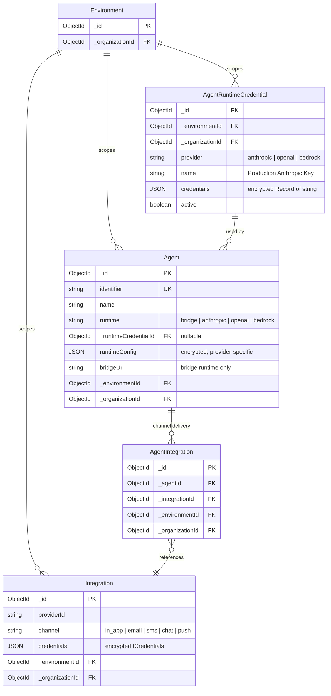
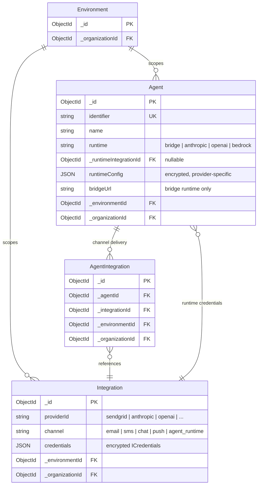
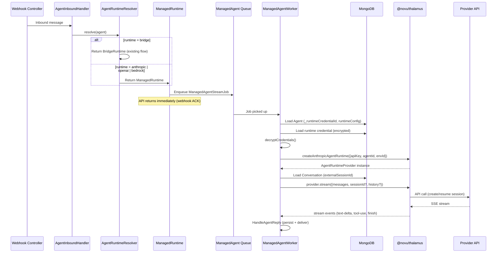
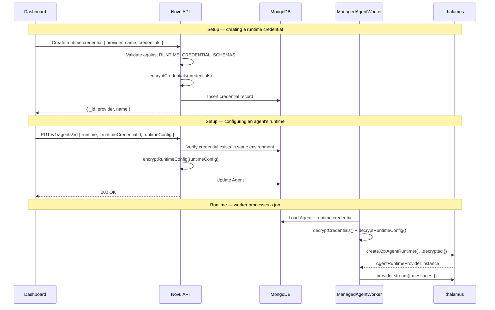
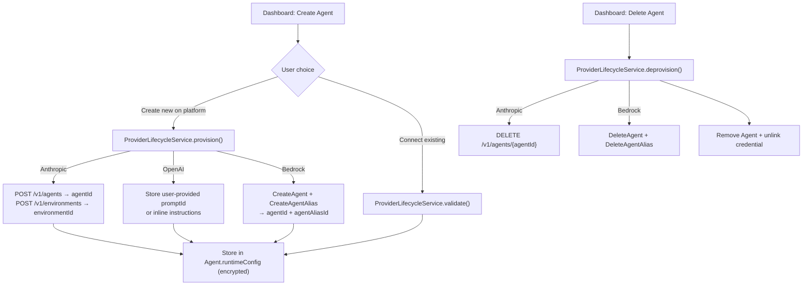
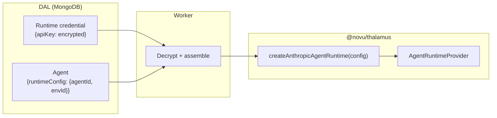

# Agent Runtimes — Provisioning & Credential Architecture

> Companion to `2026-05-07-agent-runtimes-design.md`.
> Covers the Novu API/DAL layer that stores credentials, provisions agents on provider platforms, and wires the `@novu/thalamus` package into the worker pipeline.

---

## 1. Credential Storage — Open Decision

Runtime credentials (API keys for Anthropic, OpenAI, Bedrock, etc.) need an environment-scoped, encrypted store that agents reference. Two viable options:

### Option A: New `AgentRuntimeCredential` entity

A dedicated entity purpose-built for runtime credentials.

**Pros:**
- Clean domain separation — runtime credentials don't share a table with notification provider credentials
- No unused fields (`primary`, `priority`, `conditions`, `channel` are irrelevant)
- `credentials` can be a generic `Record<string, string>` instead of the 55+ field `ICredentials` bag
- No risk of affecting existing Integration queries, indexes, or logic

**Cons:**
- New repository (extending `BaseRepositoryV2`), schema, CRUD service, controller, DTOs, dashboard pages — all replicating patterns that already exist for Integration
- Nearly identical shape to Integration (env-scoped, encrypted credentials, name, active flag, provider identifier)

### Option B: Reuse the existing `Integration` entity

Add runtime providers (Anthropic, OpenAI, Bedrock) as a new category of Integration.

**Pros:**
- All CRUD, encryption, dashboard UI, and environment sync infrastructure already exists
- `ICredentials` already has `apiKey`, `secretKey`, `region` — the exact fields runtimes need
- Follows Novu convention: credentials are always stored as Integrations
- Significantly less code to build

**Cons:**
- `ChannelTypeEnum` needs a new value (e.g. `AGENT_RUNTIME`) that isn't a notification channel — though agent conversations are unreleased, so the enum can be changed freely
- `ICredentials` carries many irrelevant optional fields (all harmless but noisy)
- `primary` / `priority` / `conditions` are meaningless for runtimes (optional, just unused)
- Must ensure `SelectIntegration` and `ChannelFactory` don't accidentally pick up runtime integrations — filter by channel type
- Agent references the integration via a direct FK (`_runtimeIntegrationId`), NOT through the `AgentIntegration` join table (which stays exclusively for channel delivery)

### Comparison

| Aspect | Option A (new entity) | Option B (reuse Integration) |
|--------|----------------------|----------------------------|
| Build cost | High — new repo, schema, CRUD, DTOs, dashboard | Low — extend existing |
| Domain purity | Clean separation | Runtime credentials share table with notification credentials |
| Credential shape | `Record<string, string>` | `ICredentials` (55+ optional fields, only a few used) |
| Env sync | Must implement | Already works |
| Dashboard | Must build | Extend existing integration pages |
| Risk to existing code | None | Must guard `SelectIntegration` / `ChannelFactory` from runtime integrations |

**Decision: TBD** — to be made by the implementer based on whether build cost or domain purity matters more for this phase.

---

## 2. Data Model

### Entity Relationship — Option A (new entity)



### Entity Relationship — Option B (reuse Integration)



In Option B, `Integration` gains `channel: 'agent_runtime'` entries alongside existing notification channels. The agent references these via `_runtimeIntegrationId` (direct FK), completely separate from the `AgentIntegration` join table used for channel delivery.

### Agent entity changes

Regardless of credential storage option:

```typescript
// Additions to existing Agent entity

runtime: AgentRuntimeEnum;                  // defaults to 'bridge'
_runtimeCredentialId?: string;              // FK → credential entity (null for bridge)
                                            // Option A: points to AgentRuntimeCredential
                                            // Option B: points to Integration (with channel = agent_runtime)
runtimeConfig?: Record<string, unknown>;    // encrypted, provider-specific identifiers
```

`runtimeConfig` stores provider-specific identifiers that are per-agent, not per-credential:

| Provider | `runtimeConfig` contents |
|----------|-------------------------|
| Anthropic | `{ agentId, environmentId, model? }` |
| OpenAI | `{ promptId?, instructions?, tools?, model? }` |
| Bedrock | `{ agentId, agentAliasId, region, agentResourceRoleArn?, memoryId? }` |

---

## 3. Runtime Resolution — End-to-End Flow

How an inbound message flows through the provisioning layer to the core package:



### `AgentRuntimeResolver` — the decision point

```typescript
// apps/api/src/app/agents/runtimes/agent-runtime.resolver.ts

@Injectable()
class AgentRuntimeResolver {
  resolve(agent: AgentEntity): AgentRuntime {
    switch (agent.runtime) {
      case AgentRuntimeEnum.BRIDGE:
        return this.bridgeRuntime;

      case AgentRuntimeEnum.ANTHROPIC:
      case AgentRuntimeEnum.OPENAI:
      case AgentRuntimeEnum.BEDROCK:
        return this.managedRuntime;

      default:
        throw new UnprocessableEntityException(`Unknown runtime: ${agent.runtime}`);
    }
  }
}
```

### Worker credential assembly

```typescript
// apps/worker — inside ManagedAgentWorker.processJob()

private async resolveProvider(job: ManagedAgentStreamJob): Promise<AgentRuntimeProvider> {
  const agent = await this.agentRepository.findById(job.data.agentId, '*');
  // Load runtime credential — from AgentRuntimeCredential (Option A) or Integration (Option B)
  const credential = await this.loadRuntimeCredential(agent._runtimeCredentialId);
  const decrypted = decryptCredentials(credential.credentials);
  const config = decryptRuntimeConfig(agent.runtimeConfig);

  switch (agent.runtime) {
    case AgentRuntimeEnum.ANTHROPIC:
      return createAnthropicAgentRuntime({
        apiKey: decrypted.apiKey,
        agentId: config.agentId,
        environmentId: config.environmentId,
        model: config.model,
      });

    case AgentRuntimeEnum.OPENAI:
      return createOpenAIAgentRuntime({
        apiKey: decrypted.apiKey,
        promptId: config.promptId,
        instructions: config.instructions,
        model: config.model,
      });

    case AgentRuntimeEnum.BEDROCK:
      return createBedrockAgentRuntime({
        region: config.region,
        agentId: config.agentId,
        agentAliasId: config.agentAliasId,
        credentials: {
          accessKeyId: decrypted.accessKeyId,
          secretAccessKey: decrypted.secretAccessKey,
        },
      });
  }
}
```

---

## 4. Credential Schemas Per Provider

Each provider declares what credentials it needs. Used for dashboard form rendering and API validation.

```typescript
// apps/api/src/app/agents/providers/credential-schemas.ts

const RUNTIME_CREDENTIAL_SCHEMAS: Record<AgentRuntimeEnum, RuntimeCredentialField[]> = {
  [AgentRuntimeEnum.ANTHROPIC]: [
    { key: 'apiKey', displayName: 'API Key', type: 'secret', required: true },
  ],
  [AgentRuntimeEnum.OPENAI]: [
    { key: 'apiKey', displayName: 'API Key', type: 'secret', required: true },
    { key: 'organizationId', displayName: 'Organization ID', type: 'string', required: false },
  ],
  [AgentRuntimeEnum.BEDROCK]: [
    { key: 'accessKeyId', displayName: 'Access Key ID', type: 'secret', required: true },
    { key: 'secretAccessKey', displayName: 'Secret Access Key', type: 'secret', required: true },
  ],
};

const RUNTIME_CONFIG_SCHEMAS: Record<AgentRuntimeEnum, RuntimeConfigField[]> = {
  [AgentRuntimeEnum.ANTHROPIC]: [
    { key: 'agentId', displayName: 'Claude Agent ID', required: true },
    { key: 'environmentId', displayName: 'Environment ID', required: true },
    { key: 'model', displayName: 'Model', required: false },
  ],
  [AgentRuntimeEnum.OPENAI]: [
    { key: 'promptId', displayName: 'Prompt ID', required: false },
    { key: 'instructions', displayName: 'Instructions', type: 'textarea', required: false },
    { key: 'model', displayName: 'Model', required: false },
  ],
  [AgentRuntimeEnum.BEDROCK]: [
    { key: 'agentId', displayName: 'Agent ID', required: true },
    { key: 'agentAliasId', displayName: 'Agent Alias ID', required: true },
    { key: 'region', displayName: 'AWS Region', required: true },
    { key: 'agentResourceRoleArn', displayName: 'Agent IAM Role ARN', required: false },
  ],
};
```

---

## 5. Credential Storage & Retrieval Flow



---

## 6. Provider Lifecycle — Provisioning & Validation

The `ProviderLifecycleService` handles creating/validating/deleting agents on the provider's platform. This is separate from credential storage — credentials are shared, but provisioned agents are per-Novu-agent.

Most managed agent platforms support full provisioning via API:

| Platform | Provision | Validate | Deprovision |
|----------|-----------|----------|-------------|
| Anthropic | `POST /v1/agents` + `POST /v1/environments` | Check agent/env exist | `DELETE /v1/agents/{id}` |
| OpenAI | Assistants API sunsetting Aug 2026; Responses API uses dashboard Prompts — provision stores config, validates prompt | Check API key + prompt | N/A (Prompts managed in dashboard) |
| Bedrock | `CreateAgent` + `CreateAgentAlias` via AWS SDK | `GetAgent` — check agent/alias exist, IAM permissions | `DeleteAgent` + `DeleteAgentAlias` |
| Mistral | `client.agents.create()` | Check agent exists | `client.agents.delete()` |
| LangGraph | `POST /assistants` | Check assistant exists | `DELETE /assistants/{id}` |
| Vertex AI | ADK `adk deploy` to Agent Engine | Check agent exists | Agent Engine delete |



### Interface

```typescript
// apps/api/src/app/agents/providers/provider-lifecycle.interface.ts

interface ProviderLifecycleService {
  provision(params: {
    credentials: DecryptedCredentials;       // decrypted API key / access keys
    config: Record<string, unknown>;         // user-provided config (agentId, region, etc.)
  }): Promise<{
    runtimeConfig: Record<string, unknown>;  // stored on Agent
  }>;

  validate(params: {
    credentials: DecryptedCredentials;
    runtimeConfig: Record<string, unknown>;
  }): Promise<boolean>;

  deprovision(params: {
    credentials: DecryptedCredentials;
    runtimeConfig: Record<string, unknown>;
  }): Promise<void>;
}
```

---

## 7. Integration Points — Existing Code Changes

### Files to modify

| File | Change |
|------|--------|
| `libs/dal/src/repositories/agent/agent.entity.ts` | Add `runtime`, `_runtimeCredentialId`, `runtimeConfig` fields |
| `libs/dal/src/repositories/agent/agent.schema.ts` | Add fields to Mongoose schema |
| `apps/api/src/app/agents/agents.controller.ts` | New endpoints for runtime credentials, runtime config on agent CRUD |
| `apps/api/src/app/agents/services/agent-config-resolver.service.ts` | No change — this resolves chat channel config, not runtime |
| `apps/api/src/app/agents/agents.module.ts` | Register new services |

### New files

```
apps/api/src/app/agents/
├── runtimes/
│   ├── agent-runtime.interface.ts
│   ├── agent-runtime.resolver.ts
│   ├── bridge.runtime.ts                    # wraps existing BridgeExecutorService
│   └── managed.runtime.ts                   # enqueues jobs, handles actions
├── providers/
│   ├── provider-lifecycle.interface.ts
│   ├── credential-schemas.ts
│   ├── anthropic/
│   │   └── anthropic-lifecycle.service.ts
│   ├── openai/
│   │   └── openai-lifecycle.service.ts
│   └── bedrock/
│       └── bedrock-lifecycle.service.ts
└── dtos/
    └── runtime-config.dto.ts
```

**Option A additionally requires:**

```
libs/dal/src/repositories/
└── agent-runtime-credential/
    ├── agent-runtime-credential.entity.ts
    ├── agent-runtime-credential.schema.ts
    └── agent-runtime-credential.repository.ts

apps/api/src/app/agents/
└── services/
    └── agent-runtime-credential.service.ts  # CRUD + encryption
```

**Option B additionally requires:**
- New `ProvidersIdEnum` entries for runtime providers (e.g. `Anthropic`, `OpenAI`, `Bedrock`)
- New `ChannelTypeEnum.AGENT_RUNTIME` value
- Guard `SelectIntegration` and `ChannelFactory` to exclude `AGENT_RUNTIME` integrations

### Untouched

- `AgentIntegration` — stays exclusively for chat channel linking
- `AgentConfigResolver` — continues to resolve chat channel config only

---

## 8. API Endpoints

### Runtime Credential CRUD

**Option A** — new endpoints:

| Method | Path | Description |
|--------|------|-------------|
| `POST` | `/v1/agents/runtime-credentials` | Create a credential (encrypt + store) |
| `GET` | `/v1/agents/runtime-credentials` | List credentials for environment (redacted) |
| `GET` | `/v1/agents/runtime-credentials/:id` | Get single credential (redacted) |
| `PUT` | `/v1/agents/runtime-credentials/:id` | Update credential |
| `DELETE` | `/v1/agents/runtime-credentials/:id` | Delete (fails if any agent references it) |

**Option B** — use existing `/v1/integrations` endpoints with `channel: 'agent_runtime'`.

### Agent Runtime Config

| Method | Path | Description |
|--------|------|-------------|
| `PUT` | `/v1/agents/:id/runtime` | Set runtime type + credential ref + provider-specific config |
| `POST` | `/v1/agents/:id/runtime/provision` | Provision agent on provider platform |
| `POST` | `/v1/agents/:id/runtime/validate` | Validate runtime config + test connection |

---

## 9. Boundary With the Core Package

The provisioning layer and `@novu/thalamus` interact at exactly two points:

### Factory functions (worker → package)

The worker assembles config from DAL entities and calls the package's factory:



The package is stateless — it receives a plain config object, returns a provider instance. It has no knowledge of MongoDB, encryption, or Novu's data model.

### `AgentRuntimeEnum` (shared type)

```typescript
// packages/shared/src/types/agent-runtime.ts

enum AgentRuntimeEnum {
  BRIDGE = 'bridge',
  ANTHROPIC = 'anthropic',
  OPENAI = 'openai',
  BEDROCK = 'bedrock',
}
```

Used by both the DAL (Agent entity) and the core package (provider string constants). The package exports string constants (`ANTHROPIC`, `OPENAI`, `BEDROCK`) that happen to align with the enum values, but doesn't import the enum — keeping it dependency-free.

### What the package does NOT know about

- How credentials are stored or encrypted
- The credential entity (whether `AgentRuntimeCredential` or `Integration`)
- The `Agent` entity or `runtimeConfig`
- BullMQ queues or job payloads
- `HandleAgentReply` or delivery

The package is a pure library — it receives plain config objects and returns provider instances. All Novu-specific concerns (encryption, DAL, queues) live in the provisioning layer.
